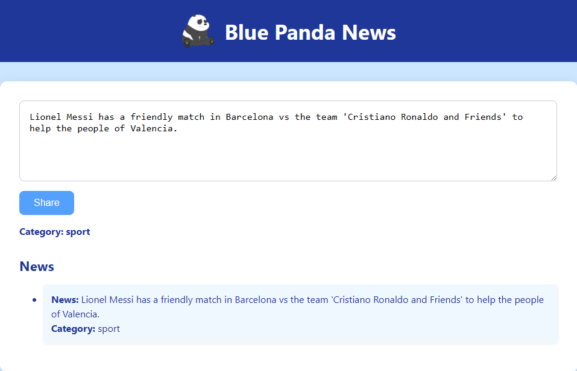

# 🐼 Blue Panda News - Clasificador de Noticias

**Blue Panda News** es una aplicación web interactiva que permite clasificar noticias escritas por el usuario según su contenido. El proyecto está dividido en dos partes principales: un backend hecho con FastAPI y un frontend desarrollado con HTML, CSS y JavaScript.

---

## 📘 Descripción del Proyecto

El objetivo del sistema es permitir a los usuarios ingresar textos tipo noticia, clasificarlos automáticamente por categoría (ej. Deportes, Economía, Política, etc.), y mostrar un historial de noticias ya ingresadas juntoa su categoría.

---

## ⚙️ Tecnologías Utilizadas

- Python 3
- FastAPI
- Uvicorn
- HTML, CSS, JavaScript
- Servidor local con `http.server` o Live Server

---

## 🛠️ Instalación y Ejecución

### 1. Descargar el proyecto

Cloná este repositorio o descargá el archivo `.zip` y descomprimilo:

```bash
git clone https://github.com/JuandiGuti/news-classifier
cd news-classifier
```

---

### 2. Ejecutar el servidor de la API

Abrí una **primera terminal** y ejecutá:

```bash
cd backend
venv\Scripts\activate          # En Windows
# o
source venv/bin/activate         # En Linux/Mac

pip install fastapi uvicorn      # Instalar dependencias

uvicorn main:app --reload        # Ejecutar servidor API en http://localhost:8000
```

---

### 3. Ejecutar el frontend

En una **segunda terminal**, ejecutá:

```bash
cd frontend
python -m http.server 5500       # Inicia servidor estático
```

Después abrí tu navegador en:  
👉 `http://localhost:5500`

> También podés usar la extensión Live Server de VS Code si preferís.

---

## 📂 Estructura del Proyecto

```
blue-panda-news/
├── api/               # API con FastAPI
|   ├── classifier/
|       └── notebook.ipynb
|       └── classifier.py
|       └── load_data.py
|       └── tokenizer.py
|       └── TRAINING-DATA/
|           └── ...
│   ├── main.py
│   └── venv/
├── frontend/              # Interfaz de usuario
│   ├── index.html
│   ├── styles.css
│   ├── script.js
│   └── img/
│       └── panda.png
└── README.md
```

---

## 📸 Vista previa



---
